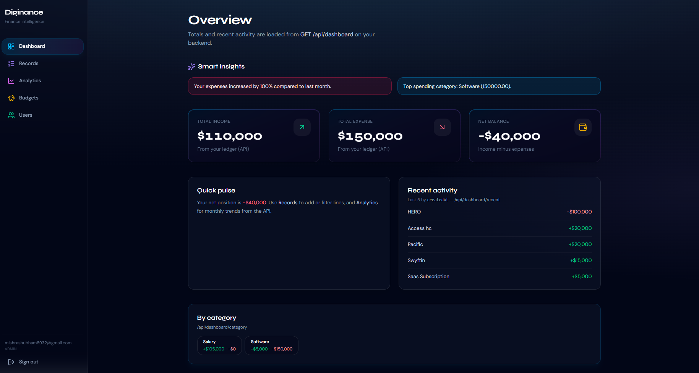
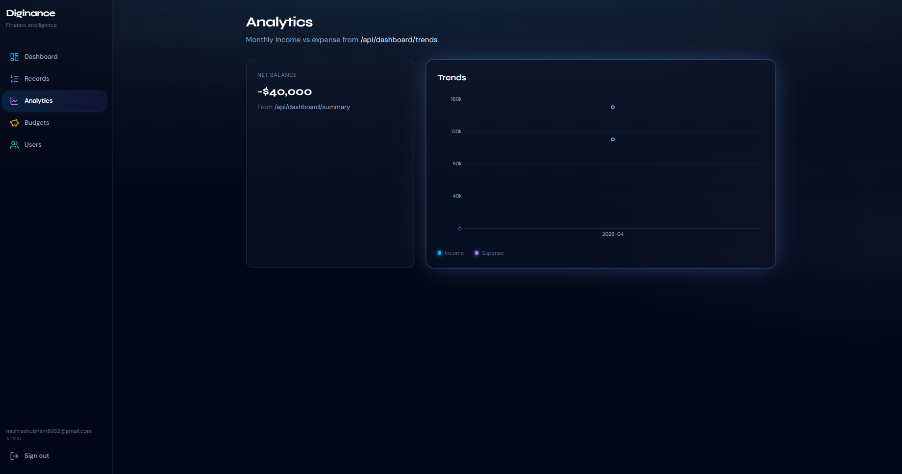
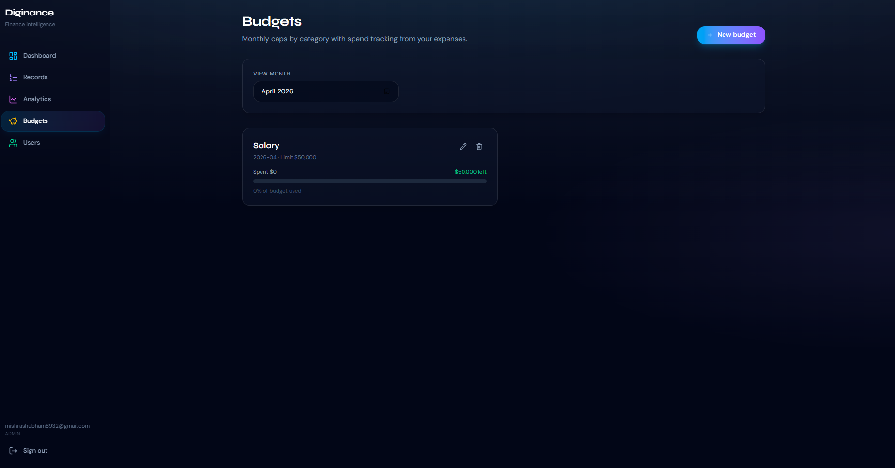

# Diginance 🚀

A full-stack **personal finance dashboard**: track income and expenses, analyze trends, set monthly budgets, run recurring entries, export CSV reports, and view smart spending insights.

Built as a **dark, SaaS-style React app** on a **JWT-secured Express + MongoDB backend**.

---

## 🚀 Preview



---

## 📸 Screenshots

### 🧭 Dashboard


### 📊 Analytics



### 📋 Records


### 💰 Budgets



---

## ✨ Features

| Area            | What you get                                                 |
| --------------- | ------------------------------------------------------------ |
| 🔐 Auth         | Register/login with JWT + roles (`user`, `manager`, `admin`) |
| 💰 Transactions | Create, filter, search, sort, pagination                     |
| 📊 Dashboard    | Income, expense, trends, categories                          |
| 🧠 Insights     | Smart monthly analysis                                       |
| 💳 Budgets      | Monthly category limits                                      |
| 🔁 Recurring    | Auto transactions using cron                                 |
| 📤 Export       | CSV download                                                 |
| 👤 Admin        | User management                                              |

---

## 🛠 Tech Stack

* **Frontend**: React, Vite, Tailwind, Recharts
* **Backend**: Node.js, Express, MongoDB, Mongoose
* **Auth**: JWT, bcrypt
* **Extras**: node-cron, CSV export

---

## 📂 Project Structure

```
Project/
├── src/
├── .env
└── package.json

diginance-ui/
├── src/
├── .env
└── package.json

assets/
├── dashboard.png
├── analytics.png
├── record.png
├── budgets.png
```

---

## ⚙️ Setup

### 1. Install dependencies

```bash
cd Project
npm install

cd diginance-ui
npm install
```

---

### 2. Setup environment

#### Backend (.env)

```env
CONNECTION_STRING=your_mongodb_url
JWT_SECRET=your_secret
PORT=7002
```

---

### 3. Run project

```bash
cd Project
npm run dev

cd diginance-ui
npm run dev
```

---

## 🔌 API Overview

* `/api/auth/*` → Auth
* `/api/transactions` → Records
* `/api/dashboard/*` → Analytics
* `/api/budgets/*` → Budget system
* `/api/insights` → Smart insights
* `/api/reports/export` → CSV export
* `/api/users/list` → Admin

---

## 🔐 Security

* JWT protected routes
* Role-based access
* User data isolation

---

## 🏆 Highlights

✔ Full-stack SaaS-style app
✔ Advanced backend (aggregation, cron)
✔ Clean UI (dark premium theme)
✔ Real-world finance features

---

## 📌 Author

**Shubham Mishra**

---

## 📜 License

ISC

---

💡 *Diginance — Finance intelligence, simplified.*
